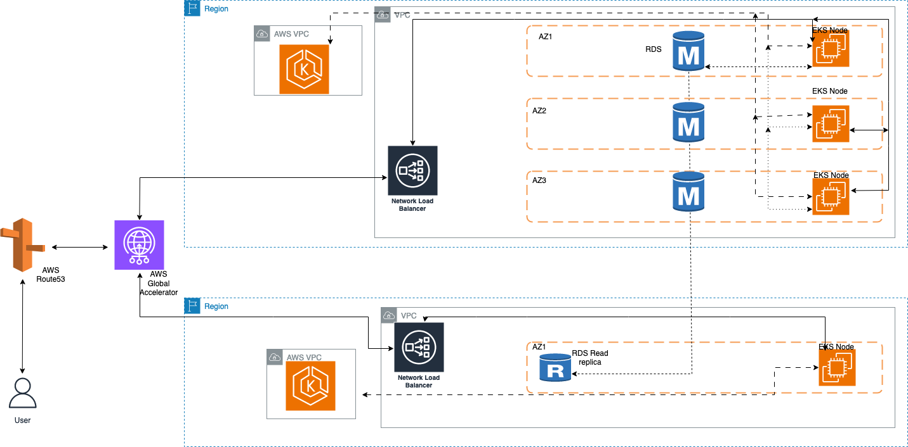
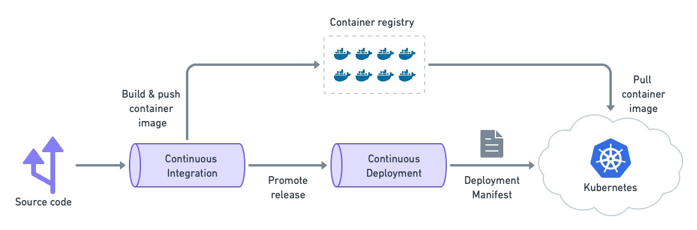
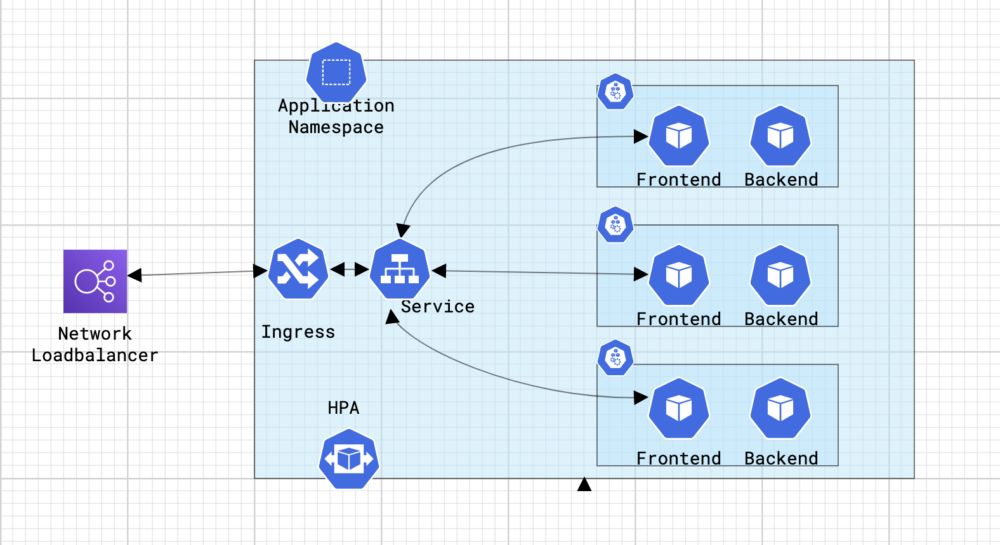

# Architecture

## Infrastructure Platform Selection

* For the infrastructure platform, I recommend using a combination of Amazon Web Services (AWS) and Kubernetes. I shall provide more details about Kubernetes in the next sections.

### Why AWS?

* **Scalability:** AWS provides elastic scaling capabilities, allowing you to easily scale resources up or down to handle varying workloads. This is crucial for a microservices architecture that requires dynamic scaling based on demand. (This is provided in almost all the cloud service providers)

* **Architecture**


## Orchestration Technology Selection:

* Kubernetes declarative system makes it an ideal platform to operate multi-region deployments.

* In a declarative system, you declare the desired state, and the system observes the current and desired state and determines the actions required to reach the desired state from the current state.

* Kubernetes’ declarative system makes it easier for you to set up applications and let Kubernetes manage the system state. This allows you to use GitOps tools like Flux and ArgoCD that let you control multiple Kubernetes clusters using a single source of truth.

* These tools help you minimize configuration drift, an issue to which most concurrent deployments are vulnerable. It provides extended deployment and scaling capabilities, and automatically manages containerized applications.

* The Amazon EKS cluster provisioned per Region helps you to deploy and manage your containerized applications across Regions for High Availability (HA), Disaster Recovery (DR) and reduced latency.

## Infrastructure Automation

Infrastructure automation is divided into two layers.

* Layer-1:
  * Underlying infrastructure - in this case AWS resources which are required for Kubernetes to run.

* Layer -2
  * Applications running on kubernetes which helps us to make the microservices more secure and easily reachable. 

### Layer -1, AWS

* **IaC Tool:** We will use terraform to automate resource creation in AWS.
* IaC is added under `code_samples/terraform`
* The code blocks are divided into different files. Each file represents a component inside the layer.


#### VPC and networks

* As the initial step, a `VPC` will be created with a the different types of subnets, one is `Public` and another one is `Private`.

  * For the creation of VPC, We can make use of the existing VPC modules which are available in Terraform registry. 

  * We can use 10.0.0.0/16 for this purpose.
  * the division of subnet will look like this, We have to make sure that private subnets gets the majority number of IP addresses so that we can schedule the workloads properly.

  * Public subnets can have minimum number of IP addresses available for them.

  * The rest of the available can be used for future developments.

The division and number of hosts available for each subnet is available [here](https://www.davidc.net/sites/default/subnets/subnets.html?network=10.0.0.0&mask=16&division=15.f901). 

  ```bash
  Private Subnet-A 10.0.64.0/18
  Private Subnet -B 10.0.128.0/18
  Private Subnet - C 10.0.192.0/18

  Public Subnet -A 10.0.0.0/21
  Public Subnet - B 10.0.8.0/21
  Public Subnet - C 10.0.16.0/21
  ```

#### Postgres Instance

* Amazon RDS PostgreSQL Primary Instance: The primary database instance running in the source region in the same VPC that was created earlier.

* Multi-AZ Deployment: Enabled for the primary instance to ensure high availability within the source region.
* Cross-Region Read Replica: A read-only replica of the primary database created in a different AWS region to provide disaster recovery and read-scalability.
* VPC Peering: We need to establish network connectivity between the source and target regions.
* Security Groups and Network ACLs: Security groups and network ACLs are configured to control inbound and outbound traffic to the RDS instances

##### Considerations

1.Monitoring

* Use Amazon CloudWatch to monitor replication lag, CPU utilization, and other performance metrics. (stretch goal to integrate cloudwatch with Grafana to have monitoring visualization in one place)

* Implement automated alarms to alert on replication issues.

2.Maintenance

* Regularly backup both the primary and replica instances using automated RDS backups.

* Schedule maintenance windows to apply patches and updates.

3.Security Considerations

* Ensure that appropriate AWS Identity and Access Management (IAM) roles are assigned to instances for necessary permissions.

* Use security groups to restrict incoming and outgoing traffic to only essential ports and sources.

* Enable encryption at rest and in transit for both the primary instance and read replica.

* Implement a strong password policy and manage database credentials securely.

* Regularly monitor and apply security patches and updates for PostgreSQL.

* Implement AWS CloudWatch alarms and monitoring to detect and respond to security events.

Please refer to `code_samples/terraform/rds.tf` for code sample.

#### EKS

##### Design Considerations

1.High Availability

Considerations:

* Multi-AZ Deployment: The EKS cluster should span multiple AZs to tolerate AZ failures. Ensure that the EKS control plane and worker nodes are distributed across AZs.

* Managed Node Groups: Use managed node groups for worker nodes, as they automatically distribute nodes across AZs. Configure node group scaling options to maintain desired capacity.

* EKS Control Plane High Availability: EKS control plane is managed by AWS, which ensures high availability by default. 

2.Scalability

Considerations:

* With Amazon EKS managed node groups, you don't need to separately provision or register the Amazon EC2 instances that provide compute capacity to run your Kubernetes applications. You can create, automatically update, or terminate nodes for your cluster with a single operation. Node updates and terminations automatically drain nodes to ensure that your applications stay available.

* Kubernetes Horizontal Pod Autoscaling (HPA): Configure Kubernetes HPA to automatically scale the number of pods in response to CPU or custom metrics.

* Resource Management: Optimize Kubernetes resource requests and limits to prevent resource contention and ensure efficient resource utilization.

3.Security

Considerations:

* IAM Roles and Policies: Assign IAM roles to worker nodes with the least privilege principle. Use IAM roles for service accounts (IRSA) to control pod-level permissions.

* Security Groups and Network ACLs: Define security group rules and network ACLs to control inbound and outbound traffic to worker nodes. Implement least privilege access.

* Encryption: Enable encryption in transit and at rest for data in the EKS cluster. Use TLS for communication between clients and the cluster.

* Cluster Authentication: Implement authentication mechanisms such as AWS Identity and Access Management (IAM), Amazon Cognito, or OpenID Connect for user and application authentication.

* Kubernetes RBAC: Configure Kubernetes Role-Based Access Control (RBAC) to limit access to cluster resources based on roles and role bindings.

* Audit Logs: Enable and monitor Kubernetes audit logs for tracking and analyzing user and resource interactions. Ensure log data is securely stored and retained as needed.

4.AWS Resources and Configuration
4.1. VPC Configuration

Considerations:

* VPC Design: Define a VPC with multiple private and public subnets distributed across AZs. Ensure adequate CIDR block allocation.

* VPC Peering and Transit Gateway: Plan for VPC peering or Transit Gateway if additional VPCs need to communicate with the EKS cluster.

4.2. EKS Cluster Configuration

Considerations:

* Cluster Version: Specify the desired Kubernetes version for the cluster.

* Control Plane Configuration: Ensure that the EKS control plane is distributed across multiple AZs and managed by AWS.

* Cluster Networking: Choose a suitable CNI plugin (e.g., AWS VPC CNI) and set up networking policies.

* Use the cluster add-ons that are available with EKS which installs kube-proxy, CNI and DNS on the cluster.

4.3. Managed Node Groups Configuration

Considerations:

* Instance Types: Select instance types based on application resource requirements and expected workloads.

* Scaling Configuration: Define minimum, maximum, and desired node capacity for scaling.

* AMI Selection: Choose an appropriate Amazon Machine Image (AMI) for worker nodes, considering performance and security patches.

* Private Subnets for Worker Nodes: Place worker nodes in private subnets to prevent direct external access and rely on NAT gateways or instances for outbound internet access.

4.4. Security Groups and Network ACLs

Considerations:

* Security Group Rules: Define security group rules to restrict inbound and outbound traffic to worker nodes based on application requirements.

* Network ACLs: Configure network ACLs at the subnet level to provide an additional layer of security.

4.5. IAM Roles and Policies

Considerations:

* Worker Node IAM Role: Create an IAM role for worker nodes with policies that grant access to required AWS services.

* IRSA: Implement IAM Roles for Service Accounts (IRSA) to manage pod-level permissions within the cluster.

#### Failover Cluster

* Deploy the EKS cluster in a different region. This will act as an active-failover or active-active cluster.

* Deploy this cluster in a single AZ to save some costs.

Please refer to `code_samples/terraform/eks.tf` for code sample.

## Layer-2

### Make Kubernetes cluster ready for application deployment

* Install AWS Load balancer controller. This manages Load balancer that is required for external access for the microservices.

* Install cert manager, which is a kubernetes add-on to automate the management and issuance of TLS certificates from various issuing sources. It runs within your Kubernetes cluster and will ensure that certificates are valid and, attempt to renew certificates at an appropriate time before these expire.

* Install cluster autoscaler for managing the worker nodes based on the usage.

* Please make sure that necessary values are set while installing these helm charts.
  * for cluster autoscaler, tags needs to be updated for auto discovery
  * for cert manager, route53 zone details has to be updated

* IRSA has to be used to for the service accounts that are attached to the aforementioned services.


## Microservice Deployment Strategy





1.Containerize Microservices:

* Follow the twelve-factor app  methodology for building the microservices.
* Package each microservice and its dependencies into Docker containers.
* Create a Dockerfile for each microservice to define its build process.
* Make sure that microservices serve metrics at an endpoint, these metrics can be used to monitor the application. 
2.Continuous Integration and Continuous Deployment (CI/CD):
* Set up CI/CD pipelines to automate building and deploying Docker images to a container registry (e.g., Docker Hub, Google Container Registry).
3.Define Kubernetes Resources:

* Create Kubernetes manifest files (YAML) for each microservice, defining the desired state of the application.
* Define the following Kubernetes resources for each microservice:
  * Deployment: Describes how many replicas of the microservice should run. For high availability, deploy multiple replicas of microservices.
  * Service: Exposes the microservice internally or externally.
  * ConfigMap/Secret: Manage configuration and sensitive data.
  * Ingress: For external access and routing

4.Namespaces:

* Organize microservices using Kubernetes namespaces for isolation and resource management.
5.Secrets Management
* Store sensitive information like API keys, database credentials, and environment-specific configuration in Kubernetes secrets.
6.Helm Charts (Optional)
* Create Helm charts for your microservices to simplify deployment, configuration, and scaling.
* Helm allows you to templatize Kubernetes manifest files and manage releases.
7.Scaling
* Configure Horizontal Pod Autoscaling (HPA) based on metrics like CPU and memory usage to scale your microservices dynamically.
8.Rolling Updates and Rollbacks:
* Implement rolling updates to deploy new versions of your microservices without downtime.
* Have a rollback strategy in place in case of issues with a new release. (This depends on the rollingUpdate parameters (maxUnavailable specifically) that you have specified. Kubernetes by default sets the value to 25%.)
9.Security:
* Follow security best practices, such as RBAC (Role-Based Access Control), PodSecurityPolicies, and network policies, to secure the cluster.
* Regularly apply security updates and patches to the container images and Kubernetes components.

Replicate the same setup in failover region.

### AWS Global accelerator and Route53 for High availability and multi region support

* AWS Global Accelerator is a service that provides a single entry point for applications hosted in multiple AWS Regions, helping improve the availability and performance of applications.

* Use Global accelerator to distribute traffic between EKS deployed in different regions.

* Direct all traffic to the primary region and route it to the failover region only if the primary region experiences issues.

* Global Accelerator can switch traffic routes without requiring DNS changes, or delays caused by DNS propagation and client-side caching.

* Set the traffic-dial-percentage parameter to ‘0’ for the secondary region’s Load balancer, all traffic will be routed to the primary region. If the primary region’s endpoint (or its associated backends) fail health checks, Global Accelerator will route traffic to the Load balancer in the failover region.

* Global Accelerator assigns a DNS name for accelerators, use this DNS name to assign it to custom DNS entry created in Route 53.

## Infrastructure Testing

1.Configuration Testing:

* Static Configuration Analysis: Review configuration files for correctness and adherence to best practices. (Eg. Git pre commit checks)
* Dynamic Configuration Testing: Validate that configurations are applied correctly and do not introduce errors. (Using CI tools to compare the difference)

2.Provisioning and Deployment Testing:

* Provisioning Tests: Ensure that provisioning scripts or tools (e.g., Terraform) create infrastructure components accurately. (Validation of the terraform plan/apply)
* Deployment Tests: Validate that application deployments and updates do not negatively impact the infrastructure. (Comparing the difference of the existing resources with intended changes, take the help of CI tools)

3.Performance Testing:

* Load Testing: Evaluate the infrastructure's response under different load levels.
* Stress Testing: Test the infrastructure's limits to identify bottlenecks and weaknesses.
* Scalability Testing: Determine how well the infrastructure scales horizontally or vertically.

4.Security Testing:

* Vulnerability Scanning: Use tools to identify security vulnerabilities in the infrastructure and Kubernetes.
* Penetration Testing: Attempt to exploit vulnerabilities to assess the infrastructure's resilience.
* Compliance Testing: Ensure infrastructure configurations comply with security and regulatory standards.

5.High Availability and Failover Testing:

* Redundancy Testing: Verify that redundant components (EKS clusters and AWS global accelerator) function as expected.
* Failover Testing: Simulate failures to check if failover mechanisms work correctly.

6.Network Testing:

* Network Connectivity Testing: Check network configurations, security groups, and routing.
* Latency and Bandwidth Testing: Measure network performance and capacity.

7.Monitoring and Alerting Testing:

* Use heartbeats to monitor critical components.

8.Scaling and Auto-scaling Testing:

* Auto-scaling Tests: Confirm that auto-scaling policies work as intended and doesn't hit the resource limits
* Resource Scaling Tests: Evaluate the ability to manually scale resources when needed.

9.Configuration Drift Monitoring

* Configuration Drift Detection: Detect and rectify any configuration changes that deviate from the expected state.

10.Disaster Preparedness Testing:

* Disaster Simulation: Conduct drills to prepare for real disasters, like AZ/region outages.


## Monitoring Approach

* Install Prometheus in the  cluster in a dedicated namespace and dedicated node group.
* Prometheus can sometimes become resource intensive, which leads to eating up the resources that application utilizes.
* This needs to be done in both the clusters (Primary and failover)
* Install Grafana
* Configure Data Sources in Grafana, Configure both the Prometheus as data sources.
* Import Dashboards
* Install Prometheus Exporters:
  * Prometheus exporters are essential to gather data from various components of your Kubernetes cluster, such as nodes, pods, and services. Depending on your use case, you can install exporters like node_exporter, kube-state-metrics, cAdvisor, and others. You can deploy them as DaemonSets, StatefulSets, or Deployments in the cluster.
* Configure Prometheus Targets:
  * Update your Prometheus configuration to scrape data from the exporters you've deployed. Add target configurations for each exporter and microservices, specifying their endpoints.(Or service monitors)
* Visualize and Monitor:
  * Use Grafana to create dashboards that visualize the data collected by Prometheus. Monitor the health and performance of the Kubernetes cluster, applications, and services through these dashboards.
  * Configure alerting within Grafana to receive notifications when predefined alerting rules are triggered.